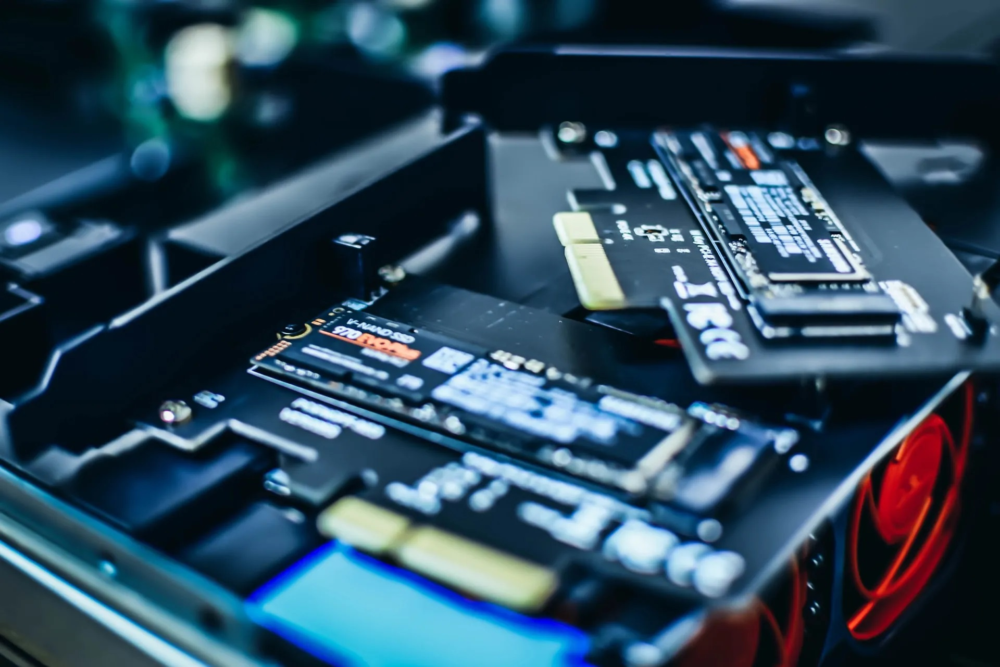

Di artikel ini kami akan menjawab beberapa pertanyaan yang sering didiskusikan oleh teman-teman kami, yang berkaitan pada storage komputer kita, sekaligus akan kami jelaskan sesingkat mungkin, jadi pertanyaan-pertanyaan itu adalah?

1. Apakah mesin yang masih menggunakan HDD jika diganti dengan  SSD, akan membuat komputer itu lebih baik dan lebih cepat?
2. Apakah HDD akan ditinggalkan selama-lamanya?
3. Apakah sebuah sistem yang sudah memakai SSD "biasa" sebaiknya diganti dengan SSD NVME?

Jawaban :

    

1. **Ya**, jika anda memang menginginkan komputer yang lebih cepat, baik dalam booting, maupun mengeksekusi sebuah tugas, maka saya jamin anda akan mengalami sendiri seolah-olah mempunyai, PC , laptop, atau Mac baru, perbedaanya akan sangat terasa. Selain itu, anda akan mendapatkan sistem yang lebih sunyi, karena tidak adanya piringan pada SSD. Storage baru anda juga akan membuat konsumsi daya yang lebih rendah, jadi jika anda memakai baterai, otomatis baterai anda akan lebih irit, kebetulan saya punya pengalaman dengan laptop Toshiba tua yang sebetulnya hanya untuk pengumpul debu, karena tertarik dengan Windows 10 waktu itu, maka saya update windows 7 saya, karena gratis juga, dan memang cukup bagus, tampilannya lebih indah, dan fiturnya cukup oke. Namun, lemot, tentu saja prosesor core i7  laptop jadul ini terlalu tua untuk windows 10, dan RAM juga hanya 4GB. Singkat cerita, setelah saya ganti dengan SSD, dan memindahkan HDD ke CD drive dengan caddy, maka Windows 10 dapat dinikmati dengan normal, serba sigap dan cepat. Saya cukup heran masih ada yang mempertanyakan SSD vs HDD di tahun 2020 ini!?
2. **Tidak** (sepertinya), HDD (termasuk SSHD) meskipun lambat dan bising jika dibandingkan dengan SSD, masih mempunyai beberapa keunggulan. Seperti harga per kapasitas yang lebih murah dan karena pengembangan HDD sudah sangat lama, maka HDD secara umum mempunyai umur yang lebih panjang, ketimbang SSD. Jika anda membutuhkan penyimpanan data yang besar, maka HDD  bisa jadi solusinya. Jadi HDD masih akan digunakan, paling tidak 10 tahun kedepan.

3. Jika anda tidak tahu anda butuh atau tidak, maka besar kemungkinan anda tidak butuh upgrade, sebuah SSD "biasa"(penjelasan lebih lengkap di bawah) sudah cukup cepat untuk anda, apalagi sistem anda tidak ada slot khusus seperti M.2, maka saya yakin tidak perlu dipaksa-paksa. Jika anda sedang merakit PC baru di tahun 2020, misalnya dengan CPU AMD Ryzen terbaru dan Motherboard yang mostly mempunyai slot M.2, situasinya akan 50-50, jika anda punya spare budget mepet, maka sebuah SATA SSD yang bagus dengan kapasitas mumpuni sudah cukup, toh anda bisa mengupgradenya nanti, mungkin ketika harga SSD NVME sudah turun. Namun jika anda mempunyai budget lebih, maka sebuah SSD NVME mungkin cocok untuk anda, tapi pastikan yang premium, seperti Samsung EVO. Besar kemungkinan anda akan sedikit atau bahkan tidak terasa perbedaan dari SATA dan NVME, karena software sekarang masih bottleneck, belum dioptimalkan. Di masa depan akan terasa gapnya, maka investasi anda akan terbayarkan. Jika anda berurusan dengan data yang masive, maka tentu akan terasa speed dari NVME.

### Suplemen Tentang SSD

#### Apa itu SSD?

**SSD (solid-state drive)** adalah jenis media penyimpanan nonvolatile(merupakan memory yang datanya datanya dapat ditulis serta dihapus, tetapi data akan tetap ada walaupun dalam kondisi off serta tidak membutuhkan catu daya) yang menyimpan data persisten pada memori flash. Memiliki dua bagian penting - **memori flash NAND** dan pengontrol flash yang dioptimalkan untuk memberikan kinerja baca-tulis yang tinggi secara berurutan serta pengambilan data acak. SSD tidak memiliki bagian yang bergerak, jadi tidak ada melanggar, berputar naik atau turun, seperti halnya dengan hard disk drive terdapat bagian berputar, serta media magnetik. SSD menawarkan keuntungan kinerja yang berbeda. Di masa lalu, harga SSD jauh lebih tinggi daripada HDD. Namun, dengan perbaikan dalam teknologi manufaktur dan kapasitas chip, harga terus menurun, yang membuatnya bernilai jauh lebih masuk akal, mengingat performa yang ditawarkan.

SSD menawarkan kecepatan transfer tinggi, latensi rendah bahkan dengan akses data acak, lebih banyak daya tahan tetapi tidak untuk penggunaan penyimpanan hirarkis, dan diharapkan tidak ada suara bagian yang bergerak. Peningkatan kinerja yang mencolok dapat dilihat dalam penggunaan sehari-hari, seperti boot sistem cepat dan mematikan kecepatan, peluncuran aplikasi lebih kuat, dan sistem terasa lebih halus dan tanpa tertinggal. Anda harus mencoba SSD untuk melihat keajaiban yang dimainkannya dengan kinerja dan kelincahan sistem komputer Anda dalam menangani beban berat. Beberapa jenis SSDs tersedia yang bersaing satu sama lain dalam hal kinerja dan faktor bentuk, kenerja yang bagus dan ketahanan memori flash.

Untuk keuntungan kinerja yang dirasakan dan nyata, penyimpanan adalah hambatan terakhir, yang dihilangkan dengan munculnya SSD dan kemudian solusi penyimpanan NVMe SSD berkinerja tinggi. SSD flash NAND secara radikal meningkatkan kinerja input-output, waktu akses turun dari 6-12 milidetik menjadi kurang dari 1ms. Namun, kurang dari 1ms waktu akses dan breakneck I / O tidak di mana saja dekat kapasitas sebenarnya dari apa flash drive bisa lakukan. Masalahnya adalah p**erangkat keras dan perangkat lunak lama** yang dibangun lebih dari lima dekade yang lalu untuk HDD, bukan SSD yang sangat cepat. Jadi  dengan kata lain yang jadi bottleneck adalah perangkat lain, dan software itu sendiri. Semisal anda menggerutu, NVME anda kok performanya sama saja dengan SATA SSD dan sedang membaca tulisan ini.

#### **Apa itu SATA SSD?**

Teknologi SATA (Serial ATA) diperkenalkan pada tahun 2003, menggantikan PATA (Parallel ATA) yang lebih lama sebagai standar antarmuka koneksi penyimpanan di komputer. Itu diantar sebagai konektor universal yang memerlukan kabel listrik dan kabel data SATA, throughput breakneck dalam kecepatan baca-tulis. Saat ini, SATA adalah incumbent pasar dan sebagian besar digunakan untuk menghubungkan SSD ke sistem komputer. SATA menggunakan protokol perintah AHCI dan mendukung IDE, yang terutama dibangun untuk drive disk berputar yang lebih tua dan lamban dan bukan untuk penyimpanan berbasis flash yang kokoh.

Ketika mencari storage untuk sistem, misal tempat dimana Windows/ Linux OS disimpan, tentu saya 99% memilih SATA SSD ketimbang HDD,namun jika murni untuk penyimpanan, 50-50 dengan HDD, jika tidak terlalu besar maka SSD, jika menyimpan data bertera-tera, maka HDD masih saya pilih, mengingat harga dan umur yang kemungkinan lebih panjang, dan memberi peringatan ketika ajal sudah dekat.

  **Apa itu NVMe SSD?**

> Ok, sebelum terjadi kesalahpahaman, kami tekankan dulu bahwa, m.2-SATA **TIDAK SAMA DENGAN** m.2 NVME/PCIE, saya sederhanakan dengan tabel pada bagian bawah artikel ini.

Non-Volatile Memory Express (NVMe) adalah antarmuka perangkat lunak standar industri terbaru untuk PCIe SSD. Secara resmi merupakan antarmuka solid-state berbasis "scalable host controller) yang dioptimalkan yang dirancang untuk memenuhi kebutuhan sistem Data Center, Enterprise, dan Client yang memanfaatkan hard disk Solid-State berbasis PCI Express (PCIe). NVMe adalah lapisan antara driver perangkat dan perangkat PCIe, men standarisasi aturan dengan penekanan pada skalabilitas, latensi rendah, dan keamanan.

Standar yang dikembangkan untuk memungkinkan SSD modern beroperasi pada kecepatan memori flash mampu, keuntungan yang tajam dengan read-write lebih cepat. NVMe SSD memungkinkan memori flash berjalan langsung melalui antarmuka bus serial PCI Express (PCIe) karena menawarkan bandwidth tinggi karena langsung melekat pada CPU daripada berfungsi melalui kecepatan SATA yang membatasi. Karena SSD menggantikan HHD yang lebih lambat sebagai penyimpanan utama, antarmuka yang cepat diperlukan untuk mencapai penggunaan kemampuan kecepatan yang lebih cepat secara optimal.

Dengan kata lain, ini adalah penggambaran teknologi bus, komponen memori (SSD) gunakan untuk berkomunikasi dengan komputer, dan bukan jenis memori baru. Antarmuka komunikasi dan driver yang menguraikan set perintah dan fitur set SSD berbasis PCIe. Muncul dalam dua faktor bentuk, M.2 atau kartu ekspansi PCIe, konektor U.2 2 2,5 inci, tetapi dengan kedua faktor bentuk, langsung terhubung secara elektrik ke motherboard melalui PCIe daripada koneksi SATA.

NVMe mendukung hingga 64K perintah per antrian, tetapi protokol hanya memerlukan tiga belas perintah untuk memberikan kinerja tinggi. Antarmuka ini dirancang untuk skalabilitas tinggi dan kemandirian NVM untuk memungkinkan teknologi generasi berikutnya menghadirkan I/O 4KB hanya dalam 10μs atau kurang, yaitu sekitar seperseribu latensi drive SATA 7200 RPM berdaya tinggi. Terlepas dari form factor, NVMe langsung berkomunikasi dengan CPU sistem dan bekerja dengan semua sistem operasi utama. SSD NVMe memperkuat solusi keamanan standar industri seperti Opal SSC dan Enterprise SSC oleh Trusted Computing Group, dengan mendukung perintah kontainer keamanan mirip dengan perintah kontainer keamanan yang ditemukan di SCSI.

Sebetulnya tulisan ini bisa diperjanjang sampai berjilid-jilid, namun saya rasa cukup sampai disini, intinya mengenai kecepatan dan performa NVME-PCIE jelas mengalahkan AHCI-SATA dengan margin yang jauh, namun saat ini masih bottleneck, terutama bagi pengguna biasa, gamer, atau video editing sekalipun, karena software dan hardware lain, belum siap. Namun tidak ada salahnya memilikinya, terutama untuk PC baru yang sudah dilengkapi slot m.2, pastikan sirkulasi udara bagus, dan NVME SSD anda juga bagus. Mungkin seiring bertambahnya waktu, performa NVME SSD anda akan meninggalkan SATA-SSD denagn margin yang besar.

##### Berikut kami lampirkan tabel-tabel untuk petunjuk:

| **Tipe**        | HDD SATA                                            | **2,5 inch SATA**                               | **M.2 SATA**               | **M.2 PCIe**                                             |
| --------------- | --------------------------------------------------- | ----------------------------------------------- | -------------------------- | -------------------------------------------------------- |
| Konektor        | SATA                                                | SATA                                            | M.2                        | M.2                                                      |
| Interface       | SATA                                                | SATA                                            | SATA                       | PCI-Express 3.0 / 4.0                                    |
| Performance     | **up to 200 MB/s**                                  | **up to 560 MB/s**                              | **up to 560 MB/s**         | **up to 3500 MB/s (PCIe 3.0)up to 5000 MB/s (PCIe 4.0)** |
| Kelebihan       | Murah  untuk storage dan umur relatif lebih panjang | Murah dan bisa kompatible dengan laptop/ PC tua | Kompak, ringkas            | Amazing speed and performance                            |
| Kekurangan      | lemot, bising, boros listrik                        | masih menggunakan perkabelan                    | Masih SATA :)              | Relatif mahal,  butuh pendinginan bagus.                 |
| Cococknya untuk | Penyimpanan data/archive                            | Laptop, PC, MAC                                 | PC Mini dan laptop kompak. | PC baru, Pengolahan data besar-besarn.                   |

Ok sekian dulu, sampai jumpa
