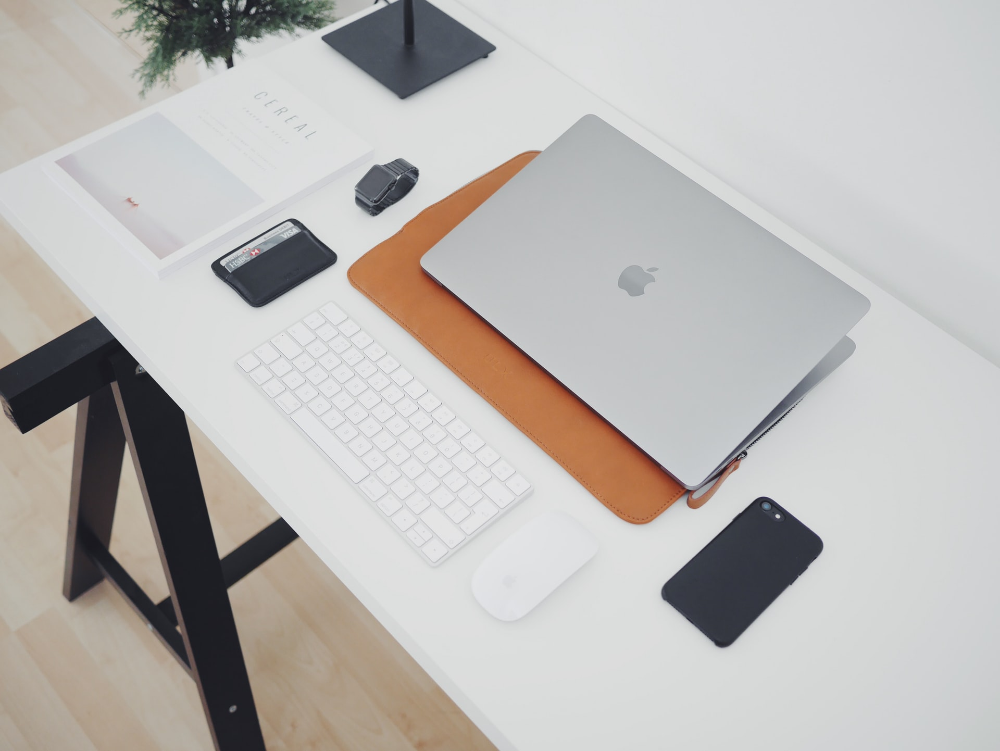

Persaingan antara MacBook dan laptop PC telah berlangsung selama bertahun-tahun. Namun saya lebih menyoroti kita, sebagai pengguna, yang berbeda pada setiap kita, sesuai dengan gaya hidup dan kebutuhan. Di satu sisi, MacBook, dan khususnya MacBook Pro andalannya, terkenal karena gayanya yang indah, kualitas build yang luar biasa, dan kecepatan penggunaan yang luar biasa. Di sisi lain, laptop PC, yang menampilkan sistem operasi Windows dan diproduksi oleh berbagai merek, terkenal karena harganya yang murah, antarmuka pengguna yang mudah diakses, dan kegunaan programnya. Selain windows yang unggul untuk gaming, laptop linux juga punya keunggulan tersendiri, banyak yang meremehkan OS ini, padahal OS meskipun gratis, dia bagus untuk beberapa hal, serius, bahkan sekarang gaming juga cukup ok. 

MacBook pertama kali dirilis di bawah bimbingan dalang teknologi Apple, Steve Jobs, pada tahun 2006. MacBook berbeda dari laptop PC karena seringkali harganya lebih mahal daripada rekan-rekannya. Macbook juga hanya menggunakan sistem operasi OS X, namun menampilkan desain estetika inovatif, kinerja secepat kilat, dan kebisingan latar belakang minimal. Asli, OSX ini di program dengan sangat baik, dan khusus untuk hardware tertentu, sehingga jika kita baca spek, sebetulnya tidak terlalu istemewa di hardware macbook atau apple pada umumnya. 

## TL/DR Macbook atau Laptop PC

Anda tidak perlu membaca artikel ini sampai habis, jika anda ingin sebuah kemewahan berkelas, dan dompet anda tebal, pilih macbook sesuai selera. Ingin sebuah kemewahan , tetapi budget agak ngepas, beli macbook lama, tetapi anda harus research secara mendalam, anda dengan uang kurang banyak, maka harus cerdas. 

Gaming, laptop, jelas itu, tapi tunggu, itu tidak harus, karena kami tidak pro dengan gaming di laptop, tapi itu pilihan anda. Kami lebih memilih  Gaming di Desktop, dan membiarkan laptop kami untuk kegiatan lain, kebetulan kami punya keduanya. 

Singkat cerita jika anda melihat sebuah sisi kemewahan pada macbook, go to macbook. Jika anda merasa privacy yang ditawakan macbook cocok untuk anda go to macbook.

Jika anda tidak mengeluarkan uang banyak, maka go to laptop. Ingin laptop kuat dan awet, bisa diajak susah, laptop biasa aja. Gaming di laptop. 

Laptop PC pertama kali muncul di panggung pada tahun 1990-an, IBM dengan thinkpadnya, saya pernah menggunakan salah satu tjhinkpad classic, memang cocok untuk kerja keras. Sejak itu, model seperti Sony Vaio, HP Pavilion dan Acer Aspire, yang terkenal karena kemudahan penggunaan dan relatif murah, telah mencapai jutaan penjualan di seluruh dunia.

Berbeda dengan MacBook, laptop PC menggunakan sistem operasi Microsoft Windows yang sangat familiar, yang menampilkan Microsoft Office di antara banyak program desktop berguna lainnya. Hal ini, pada gilirannya, menarik bagi berbagai macam demografi: siswa mengejar tugas, pekerja kantoran membuat presentasi PowerPoint, dan pemula yang mencoba menggunakan komputer pribadi untuk pertama kalinya. Namun hampir semua aplikasi pada windows sekarang sudah juga tersedia di macbook.

### Masih bingung memilih macbook atau laptop biasa?

Saat dihadapkan dengan model fisik MacBook Pro 15 ” seri tertinggi dan laptop pc seri tinggi, diletakkan berdampingan, anda kemungkinan besar akan melihat beberapa perbedaan yang mencolok dalam estetika. Jajaran MacBook Pro saat ini, misalnya, sangat memanfaatkan etos desain utilitarian. Menampilkan lekukan yang mencolok, bahan mahal, bodi tipis wafer, dan logo 'Apple' yang ada di mana-mana di setiap sampul, model MacBook Pro 15 ”dipuji oleh banyak orang karena keindahannya yang menakjubkan. Intinya jika ingin tampil seperti eksekutif, macbook, tampil seperti gamer, laptop gaming solusinya. Ingin sistem yang betul-betul private, laptop biasa dengan LINUX OS.

### Umur laptop MacBook vs. PC

Baik laptop PC dan MacBook Pro telah membuat kemajuan signifikan dalam hal masa pakai baterai. MacBook Pro 13 inci mendukung hingga 10 jam penjelajahan internet. Jika model Macbook Air dan model Macbook Pro tampak mengungguli adalah dalam masa pakainya secara keseluruhan. Cangkang aluminium unibody dari jajaran fitur MacBook Pro terbaru, seperti kebanyakan produk Apple, kualitas dan kekuatannya sangat baik, sedangkan produknya sendiri hadir dengan perjanjian garansi yang sangat kuat dan kemampuan unik untuk menikmati perbaikan gratis di Apple Store terdekat. Menarik memang (jika anda tidak peduli dengan harga), tetapi macbook seri tertentu mempunyai kelemahan yang mengganggu, seperti ada jam menghitung mundur, begitu menurut teknisi sahabat kami. Macbook akan mati pada tahun sekian, partnya kadang sudah dicari. Sedangkan laptop biasa, selain batrai soak, semuanya lancar, saya masih ada laptop berumur 11 tahun yang masih lancar.

Kesimpulan
Jika anda butuh eksklusifitas dari brand apple, jika anda ingin menjadi software developer di lingkungan apple, atau mengedit video di sistem yang sudah matang, maka belilah macbook, selebihnya laptop pc.