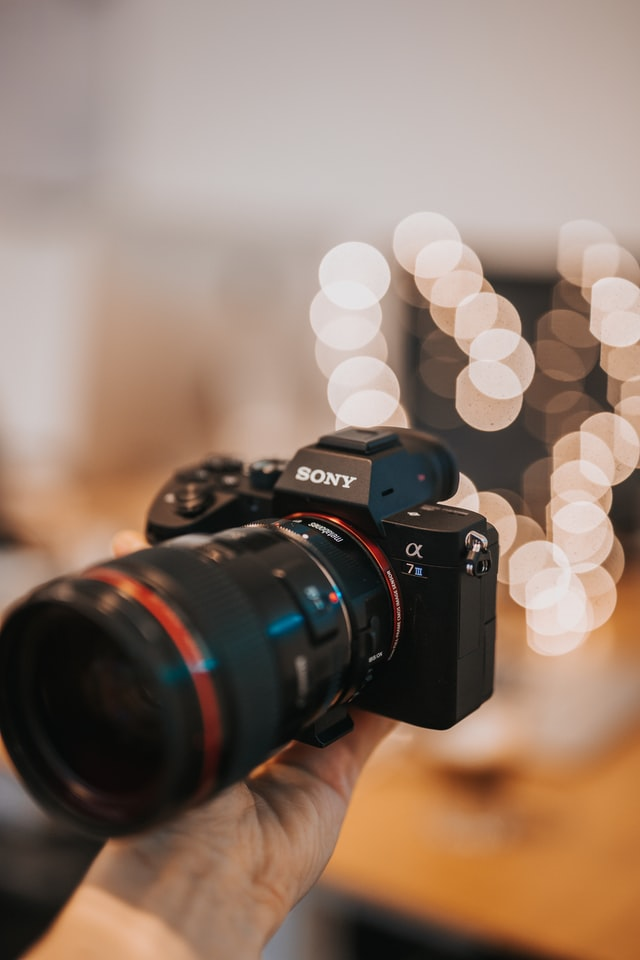

Pernah melihat foto dengan latar belakang yang ngeblur dan tidak fokus? Atau mungkin lanscape dengan detail tajam dari elemen latar depan terdekat hingga awan yang jauh? aperture memungkinkan fotografer untuk mengontrol seberapa tajam atau buram foto mereka, dan merupakan salah satu dari tiga elemen yang menentukan eksposur foto. Tapi apa sebenarnya aperture itu?Sebagai bagian dari segitiga eksposur, aperture adalah pengaturan kamera yang penting, membantu menentukan seberapa terang atau gelap gambar tersebut. Tidak seperti shutter speed kecepatan dan ISO - dua sisi lain dari segitiga itu - aperture tidak ada di kamera, tetapi lensa. Dengan mengubah pengaturan aperture, anda menambah atau mengurangi seberapa banyak lensa masuk ke sensor kamera anda.

Aperture diukur dalam f-number, atau f-stop, yang mana konsep tersebut dapat mulai menjadi sedikit lebih membingungkan. F-number kecil, seperti f / 2.8, adalah aperture lebar. F-number yang lebih besar, seperti f / 16, adalah aperture sempit. Ingatlah bahwa f-number kebalikan dari yang anda harapkan: angka yang rendah berarti lebar, dan yang lebih tinggi berarti sempit. (Angka-F sebenarnya adalah penyebut dari sebuah pecahan, jadi perhitungannya tidak sebelakang kelihatannya.)

Bagaimana anda mengubah aperture pada kamera anda?
Meskipun anda juga perlu memahami ISO dan shutter speed untuk mengontrol eksposur dalam mode manual, anda dapat mengubahnya dalam mode  prioritas aperture(A= aperture priority). Mode ini, yang ditetapkan pada sebagian besar kenop mode kamera sebagai A atau Av, memungkinkan anda untuk mengontrol aperture saja, sedangkan shutter speed dan ISO dapat tetap otomatis. (Dimungkinkan untuk melepas ISO secara otomatis jika anda mau). Mode prioritas aperture adalah cara mudah untuk mempelajari bagaimana aperture memengaruhi gambar - setelah anda memahami prioritas aperture (dan pasangannya, prioritas shutter speed), mode manual tidak akan tampak begitu menakutkan.

Pada beberapa kamera atau lensa, aperture disesuaikan melalui cincin khusus di sekitar lensa, tetapi kebanyakan kamera modern menempatkan kontrol aperture pada bodi kamera itu sendiri, biasanya dalam bentuk kenop perintah. Saat anda memutar tombol itu, anda seharusnya bisa melihat f-number berubah di viewfinder atau di layar LCD. Rentang angka yang tersedia akan bervariasi berdasarkan model lensa, jadi jika anda mencapai titik di mana kamera tidak akan mengubah aperture lagi, anda telah mencapai awal atau akhir rentang tersebut. Jadi lensa sekarang kebanyakan, terutama pada lensa dengan auto fokus, tidak ada pengaturan aperture.

#### Aperture dan "Depth of Field"

Depth of field adalah istilah fotografi yang mengacu pada seberapa banyak gambar dalam fokus, dari latar depan ke latar belakang. Anda mungkin pernah melihat potret dengan latar belakang yang sangat buram dan anda mungkin pernah melihat lanskap yang sebagian besar gambarnya tajam.  Jika anda menfoto ular, apakah anda ingin menfokuskan kepalanya saja, sedangkan badan dan ekor nge-bokeh, itu bisa dilakukan dengan merubah aperture atau bukaan lensanya.

aperture lebar, f-number kecil, berarti hanya sebagian kecil gambar yang berada dalam fokus, yang disebut depth of field dangkal. Pada f / 1.8, misalnya, mata subjek mungkin terfokus, tetapi hidungnya lembut. Dengan aperture terlebar, objek bahkan seperdelapan inci dari subjek bisa keluar dari fokus. aperture lebar sangat bagus untuk mengaburkan gangguan di latar belakang, menarik lebih banyak perhatian ke subjek, dan menciptakan titik cahaya di luar fokus yang disebut bokeh.

Aperture sempit, f-number besar, membuat lebih banyak detail utuh dan menciptakan ruang tajam yang dalam. Jika anda ingin melihat semua detail dalam pemandangan yang mengesankan di depan anda, anda ingin menggunakan aperture yang lebih sempit seperti f / 11 atau f / 16. Depth of field bekerja dengan dua cara - anda dapat menggunakan aperture lebar untuk memburamkan latar depan seperti yang anda lakukan pada latar belakang. Ini memungkinkan anda "membidik" hal-hal seperti pagar rantai, dedaunan, atau kaca reflektif untuk menampilkan subjek di latar belakang.

Fotografer juga harus memperhatikan bahwa semakin sempit aperture, semakin besar kemungkinan titik cahaya, seperti matahari, akan menciptakan starburst. Itu bisa menjadi hal yang baik atau buruk tergantung pada tampilan yang anda inginkan. Jika anda ingin matahari bersinar di beberapa pepohonan, coba gunakan aperture yang lebih sempit. Jika anda tidak peduli dengan semburat cahaya, buka sedikit aperture.

Setelah anda memahami aperture, shutter speed, dan ISO, anda dapat menangkap gambar yang terekspos dengan baik di hampir semua kondisi pencahayaan. Namun mempelajari apa yang dilakukan aperture di luar eksposur adalah yang memungkinkan anda membuat keputusan kreatif yang terinformasi tentang tampilan foto anda.

Jadi kesimpulannya jika anda ingin mengambil gambar bokeh dengan seindah mungkin, pindahkan mode otomatis anda ke aparture priority, supaya merubah bukaan lensa anda dan ambilah gambar sebanyak mungkin dengan berbagai macam skenario, jika diperlukan pindahlah ke mode manual.