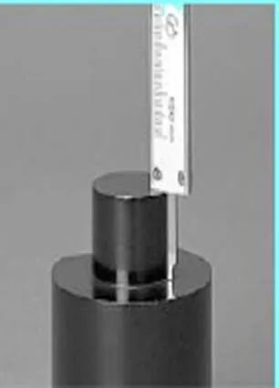

Sebuah caliper  adalah alat yang digunakan untuk mengukur jarak antara dua sisi yang berlawanan secara simetris. Kaliper bisa sesederhana kompas dengan titik-titik yang menghadap ke dalam atau ke luar. Ujung kaliper diatur agar pas melintasi titik yang akan diukur, kaliper kemudian dilepas dan jarak dibaca dengan mengukur antara ujung dengan alat ukur, seperti penggaris. 

Mereka digunakan di banyak bidang seperti pengerjaan logam, teknik mesin, pembuatan senjata, pemuatan tangan, pengerjaan kayu, pembalikan kayu, dan dalam pengobatan. 

Arti tantum jamak dari kata "caliper" hidup berdampingan dalam penggunaan alami dengan arti kata benda biasa "caliper". Artinya, terkadang kaliper diperlakukan secara kognitif seperti kacamata atau gunting, menghasilkan frasa seperti "berikan kaliper itu padaku" atau "kaliper itu milikku" mengacu pada satu unit. Namun, penggunaan ini sebagian besar bersifat sehari-hari dan arti kata benda biasa dari caliper biasanya mendominasi, terutama dalam tulisan. Tidak ada logika gramatikal yang ketat untuk mempertahankan pengertian tantum jamak; ini hanya cara bahasa terkadang mengalir secara alami dalam bahasa sehari-hari.

 Kaliper Vernier adalah alat ukur yang digunakan terutama untuk mengukur dimensi linier. Kaliper ini berguna untuk mengukur diameter benda melingkar. Rahang bundar mereka pas di kedua sisi lingkar benda bulat. Kaliper Vernier memiliki dua jenis timbangan- timbangan utama tetap dan timbangan Vernier bergerak. Skala utama biasanya dalam milimeter atau 1/10 inci. Kaliper Vernier mencetak skor lebih tinggi di atas penggaris standar karena dapat mengukur pembacaan yang tepat hingga 0,001 inci. Timbangan Vernier digunakan bersama dengan kaliper Vernier untuk pengukuran yang akurat.

 

## Beberapa jenis Jangka sorong 

 

 

 **Vernier caliper:** 

   **Dial caliper:**     

  **Digital caliper:** 

##  

## BAGIAN-BAGIAN JANGKA SORONG DAN KEGUNAANNYA

 

| **NAMA BAGIAN**                     | **KEGUNAAN**                         |
| ----------------------------------- | ------------------------------------ |
| 1. Tanduk tetap (1a) dan geser (1b) | 1. Mengukur diameter dalam           |
| 2. Rahang tetap (2a) dan geser (2b) | 2. Mengukur diameter luar dan tebal  |
| 3. Baut pengikat                    | 3. Mengunci rahang geser             |
| 4. Batang geser                     | 4. Menggeser kearah kiri dan kanan   |
| 5. Skala nonius                     | 5. Mengukur tingkat ketelitian       |
| 6. Batang kedalaman                 | 6. Mengukur kedalaman dan ketinggian |
| 7. Mistar                           | 7. Membaca ukuran utama              |

## **Macam-macam** ketelitian pada Jangka Sorong

### a. Jangka Sorong dengan ketelitian 0,1 mm

 

 

 

 x = 1 mm,

n = panjang skala utama (SU)

dibagi dengan

jumlah strip pada skala nonius Jumlah strip = 10 strip

Jadi : tingkat ketelitian Jangka Sorong

**(i) = 0,1 mm**

### **b.**  **Vernier** **Caliper dengan tingkat ketelitian 0,05 mm**

 

|      |                                                        |
| ---- | ------------------------------------------------------ |
|      |  |

x = 1 mm,

n = panjang skala utama

dibagi dengan

Jumlah strip pada skala nonius.

 

jumlah strip pada skala nonius sebanyak 20 strip

maka :

Jadi : tingkat ketelitian Jangka Sorong

**(i) = 0,05 mm**

 

 

### c.  Jangka Sorong dengan tingkat ketelitian 0,02 mm

 

x= 1 mm,

n = panjang skala utama

dibagi dengan

Jumlah strip pada skala nonius.

Jumlah strip pada skala nonius

sebanyak 50 strip

Jadi : tingkat ketelitian Jangka Sorong

**(i) = 0,02 mm**

 

## CARA PEMBACAAN SKALA PADA JANGKA SORONG

1. Lihat Skala Utama, Perhatikan angka terakhir sebelum Nol ( 0) pada skala Nonius

2. Lihat Skala utama dan skala nonius yang segaris, hitung skala noniusnya

3. Jumlahkan hasil pembacaan skala utama dan skala nonius

 

 Ketelitian 0,05 mm

#### Macam-macam pengukuran menggunakan Jangka Sorong

##### A. Pengukuran untuk dimensi/ukuran luar benda ukur

 

Langkah-langkah :

1. Buka rahang bergerak bawah mistar sorong gunakan rahang tetap dan rahang gerak)

2. Kuncilah mistar sorong

3. Lakukan pembacaan Usahakan pembacaan tanpa melepas mistar sorong dari benda ukur

##### B. Pengukuran dimensi/ukuran dalam benda kerja

 

1. Buka rahang geser.

2. Untuk  mengukur  ukuran  dalam gunakan tanduk  tetap  dan tanduk gerak.

3. Kuncilah mistar sorong.

4. Lakukan pembacaan

 

 

##### C. Pengukuran ketinggian dan kedalaman benda kerja

 

 Langkah-langkah

1. Buka rahang geser sehingga batang kedalam keluar.

2. Masukkan batang kedalaman ke dalam alur atau coakan yang akan diukur dengan tegak lurus, bila tidak akan terjadi kesalahan.

3. Kuncilah mistar sorong.

4. Lakukan pembacaan

####  CARA PENGUKURAN

###### Pengukuran Diameter luar

| Benar                                                        | Salah                                                        |
| ------------------------------------------------------------ | ------------------------------------------------------------ |
|  |  |

#### 

######  **Pengukuran** Diameter dalam

          

 

| Benar                                                        | Salah                                                        |
| ------------------------------------------------------------ | ------------------------------------------------------------ |
|  |  |

###### **Pengukuran** Kedalaman

 

|                            Benar                             |                            Salah                             |
| :----------------------------------------------------------: | :----------------------------------------------------------: |
|  |  |

