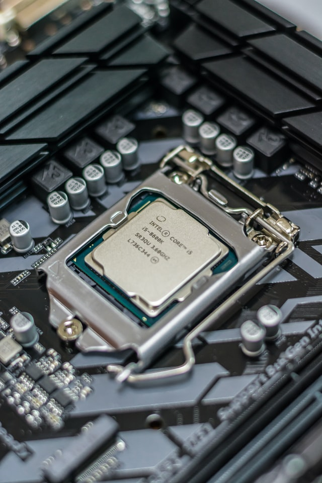

Mempunyai laptop dengan CPU Intel i7 sempat diidam-idamkan hampir semua calon pembeli laptop baru atau bekas. Walaupun sekarang, pasar sudah terbelah semenjak gempuran CPU AMD Ryzen, sebagian orang masih bertahan dengan intel.

Dan memang itu tidak salah, jika kita melihat dari sisi kepercayaan memang intel lebih unggul, karena sebagian besar dari kita adalah pengguna prosesor intel selama bertahun-tahun. Berpindah brand menimbulkan ketakutan, tidak masalah mengorbankan kecepatan, bahkan dengan harga yang lebih mahal, sebagian orang masih "main aman", dengan tidak switch ke AMD. Saya sendiri menggunakan intel mulai dari pentium atau bahkan sebelumnya, karena waktu itu, saya masih belum peduli hardware yang saya pakai, bisa menggunakan komputer saja sudah berasa sultan pada jaman itu.

### 1. Tua-tua tidak keladi

Tapi yang saya bahas disini adalah user atau calon user yang sebetulnya masih belum melek hardware, dengan dalih "cuman buat ngetik doang. Sehingga saya tergelitik membuat tulisan ini, karena banyak teman-teman saya mengeluhkan laptopnya lambat, padahal sudah intel i7, tapi generasi pertama, LOL. Tentu saja, ini termasuk prosesor kuno, tentu saja tidak bisa optimal mengoperasikan software generasi terbaru, atau bahkan tidak support. Teman saya membeli laptop itu dengan harga yang lumayan sebetulnya, tergiur dengan embel-embel i7.

Singkat cerita, teliti sebelum membeli, konsultasi dengan yang lebih tau, minimal googling dulu. intel core dimulai tahun 2006 dan core i7 tahun 2008. Jadi kalau anda lengah, bisa jadi anda membeli laptop yang sudah uzur, dan anda akan kecewa, mengingat powernya terlalu lemah untuk jaman sekarang. Bahkan untuk pengguna windows 10 direkomendasikan paling tidak intel core gen 6 ke atas. Ini juga berlaku untuk market PC bekas, yang menuliskan intel i7 sebagai bahan promosinya, padahal pc-pc bekas kantoran tersebut, sudah sangat tua.

### 2. Nostalgia atau produktifitas 

Laptop dan PC tua intel i7 tidak punya nilai produktifitas yang tinggi, saya tidak perlu membahas core i5 dan i3, karena sudah pasti di bawah performa i7. Yang harus diwaspadai adalah harga, jika anda tidak paham, maka anda akan rentan kena "tipu", kebanyakan seller menjual i7 tanpa penjelasan, harga yang dipatok terkadang tidak diterima akal sehat. Beberapa laptop sebetulnya masih mempunyai nilai yang bagus, terutama dengan discrete GPU, seperti thinkpad w540,  namun harganya diatas 7 jutaan, menyebabkan sudah tidak balance lagi antara price to performance. Ini sudah menyentuh harga laptop baru dengan garansi tahunan dan performance yang  gahar dan kekinian. Tetap ada resiko membeli barang bekas, apalagi sudah uzur, dukungan terhardap hardware bisa saja sudah berhenti. Namun jika anda memang niatnya nostalgia, tentu itu keputusan ditangan anda. Untuk kelompok Macbook, karena tumpang tindih dengan "kemewahan" dan apple environment yang menguntungkan untuk sebagian pengguna, maka bisa jadi nilainya juga masih bagus. Namun sekali lagi, ini barang bekas, terutama apple yang melemah dengan bertambahnya umur (diakui oleh mereka). Juga ada beberapa komponen yang fail pada generasi tertentu, seperti wifi card bermasalah, GPU chip fails, dll. 

### 3. Cari murah kualitas bagus?

Sebetulnya laptop baru dengan harga 4-8 Jutaan sudah mantab banget, dan sudah mengcover kebutuhan ngetik doang, sampe heavy tasking, seperti gaming, video editing. Dan tidak harus core  i7,cukup core  i5 generasi sekarang saja sudah mengalahkan dengan telak CPU i7 generasi lama. Oh ya sekarang sudah memasuki era Core i9 gen 11 untuk line up terbaik intel, kalau anda belum pernah mendengarnya, lebih banyak baca dulu sebelum mebekan tombol beli. Sebagai alternatif, tanpa ragu saya sarankan RYZEN by AMD, baik laptop maupun PC, dari segi teknologi, performa, harga dll masih mendominasi pasar CPU sampai sekarang. Satu lagi, seiring berjalannnya waktu bobot laptop semakin ringan dan bezelnya makin tipis, jadi singkat cerita jika disuruh beli laptop sekarang, bahkan dengan budget pas-pasan, katakanlah 4 jutaan kami akan cari lapton ryzen. Kalau untuk heavy tasking, maka ryzen dengan Dedicated GPU, biasanya Radeon atau NVidia juga bagus(cek lagi, untuk GPU kami lebih condong ke Nvidia sebenarnya).

##### Kesimpulan:

- Kami menyarankan laptop baru toh harganya cukup terjangkau , atau paling tidak,  laptop 2017 keatas dengan nilai dan harga yang bagus.
- Laptop baru lebih ringan, tipis, dan fiturnya lebih modern. 
- Periksa spek mesin, CPU, RAM (DDR berapa, berapa giga, dan apakah bisa diupgrade?) dan GPU, apakah ada GPU dedicated.
- Periksa spek Layar, **resolusi** dan kualitas gambarnya, jika anda beli bekas, tentu wajib untuk memeriksa layarnya dari kegagalan.
- Periksa storage dan pheriferal lain, charger, keyboard,dll. 