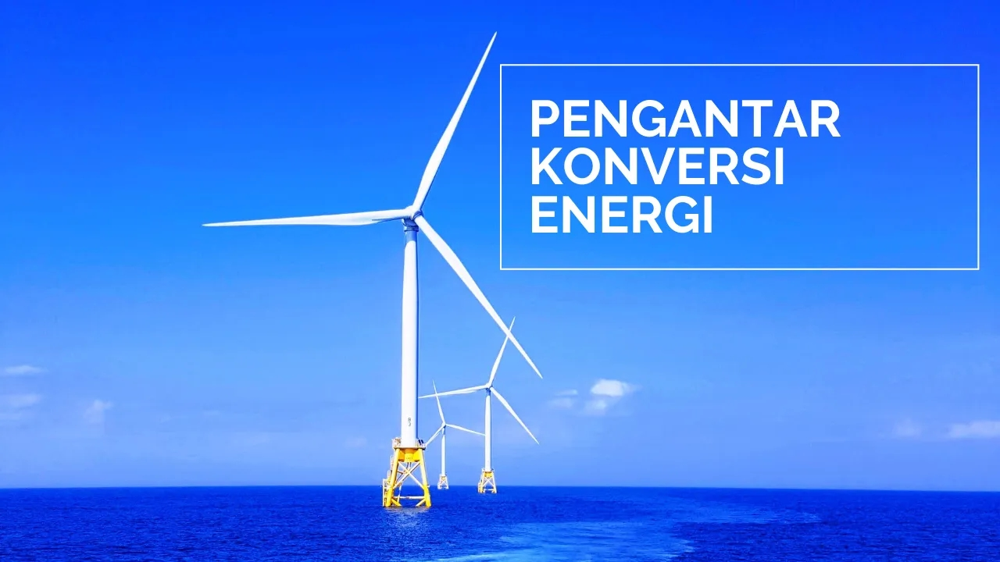

## Energi dan Konversi Energi

.

Energi adalah suatu kemampuan melakukan usaha..

**Contoh bentuk-bentuk Energi** adalah: energi matahari,energi listrik, energi kinetik, energi panas / energi termal, energi nuklir, energi kimia, dan lain lain.

**Konversi Energi: Transfer dan Transformasi**
Transfer energi adalah perpindahan energi dari satu lokasi ke lokasi lain. Misalnya, saat listrik berpindah dari steker dinding, melalui pengisi daya, ke baterai.

Transformasi energi adalah ketika energi berubah dari satu bentuk ke bentuk lainnya - seperti di bendungan pembangkit listrik tenaga air yang mengubah energi kinetik air menjadi energi listrik.

Meskipun energi dapat ditransfer atau diubah, jumlah total energi tidak berubah - ini disebut kekekalan energi.

**Apa sajakah contoh transformasi energi?**
Berikut adalah beberapa cara energi dapat berubah (bertransformasi) dari satu jenis ke jenis lainnya:

Sinar matahari; Matahari mengubah energi nuklir menjadi energi panas dan cahaya, energi makanan; Tubuh kita mengubah energi kimia dalam makanan kita menjadi energi mekanik untuk kita bergerak, 

Kipas listrik mengubah energi listrik menjadi energi kinetik,

Petir; petir mengubah energi listrik menjadi energi cahaya, panas, dan suara

**Apakah konservasi energi itu?**
Ada banyak jenis energi, termasuk kinetik, potensial, gravitasi, dan listrik.

Energi dapat ditransfer (berpindah dari satu lokasi ke lokasi lain) dan dapat berubah (mentransformasikan) dari satu jenis ke jenis lainnya - tetapi jumlah total energi selalu disimpan, yaitu tetap sama.

Energi adalah kekal, tidak dapat diciptakan dan dimusnahkan. 

Energi dapat berpindah, ke benda lain melalui suatu gaya yang menyebabkan pergeseran, sering disebut dengan energi mekanik.

**Roket**
Saat bahan bakar dibakar, gas panas keluar dari roket karena panas dan tekanan besar yang dihasilkan oleh pelepasan energi kimia dalam pembakaran.

Perpindahan energi adalah perpindahan energi dari satu lokasi ke lokasi lain. Transformasi energi adalah ketika energi berubah dari satu jenis ke jenis lainnya. Meskipun energi dapat ditransfer atau diubah, energi totalnya selalu sama.

## Jenis-jenis Energi

<iframe width="560" height="315" src="https://www.youtube.com/embed/vkiaqdKqMCM" frameborder="0" allow="accelerometer; autoplay; clipboard-write; encrypted-media; gyroscope; picture-in-picture" allowfullscreen></iframe>

**Energi Kinetik** merupakan  energi yang dimiliki oleh sebuah benda karena gerakannya.

Contoh: gerak gelombang laut, Mobil yang sedang melaju, benda jatuh, air terjun dan aliran air sungai juga memiliki energi kinetik.

**Energi Potensial** adalah suatu energi yang tersimpan pada benda kerja karena kedudukannya.

Contoh: energi potensial air, air di waduk dirubah menjadi energi mekanik kemudian dirubah menjadi energi listrik, gravitasi bumi, juga merupakan salah satu gaya yang menimbulkan energi potensial.Pegas juga digunakan untuk menyimpan energi potensial elastis.

**Energi mekanik** adalah energi total yaitu penjumlahan antara energi kinetik dan energi potensial.

Energi mekanik, merupakan energi gerak.

**Energi listrik** adalah energi yang berkaitan dengan arus elektron.

Contoh: motor starter dan alternator, lampu, solder, aki, dll

**Energi Elektromagnetik** merupakan bentuk energi yang berkaitan dengan radiasi elektromagnetik.

**Radiasi elektromagnetik** adalah kombinasi medan listrik dan medan magnet yang berosilasi dan merambat lewat ruang, dan membawa energi dari satu tempat ke tempat yang lain.

Contoh: radio,  oven Microwave , sinar laser, Inframerah, dan lain lain.

**Energi Kimia** adalah energi yang keluar sebagai hasil interaksi elektron, di mana dua atau lebih atom/molekul, berkombinasi sehingga menghasilkan senyawa kimia yang stabil. Energi kimia hanya dapat terjadi dalam bentuk energi tersimpan.

Contoh: Baterai.

**Energi Nuklir** adalah, energi dalam bentuk energi tersimpan yang dapat dilepas akibat interaksi partikel dengan atau di dalam inti atom.

Energi ini dilepas sebagai hasil usaha partikel-partikel untuk memperoleh kondisi yang lebih stabil.

**Energi Termal,** merupakan bentuk energi dasar, di mana dalam kata lain adalah semua energi yang dapat dikonversikan secara penuh, menjadi energi panas

Pembangkit Listrik Tenaga Panas sebagai contoh pemanfaatan energi geotermal.

**Energi Angin,** merupakan energi yang tidak akan habis, material utamanya berupa angin dengan kecepatan tertentu, yang mengenai turbin angin sehingga menjadi gerak mekanik dan listrik. Kincir Angin Merupakan Bentuk Perubahan Energi Angin.

### Mesin Konversi Energi

Mesin adalah suatu pesawat yang menghasilkan suatu gerak.

**Mesin Konversi Energi** adalah suatu pesawat, yang mengubah suatu energi, menjadi energi yang lain sehingga menghasilkan suatu kerja, yang dimanfaatkan untuk kepentingan manusia.

Contoh: Motor bakar, yang merubah Energi kimia (campuran bahan bakar), menjadi energi mekanik (naik turunnya poros engkol).

 Motor Starter,energi listrik dirubah menjadi energi mekanik, (yaitu gerak putar roda gigi pinion, untuk penggerak awal mesin).

Refrigator, mengubah energi listrik, menjadi Energi mekanik kemudian menjadi energi thermal.

Pompa, mengubah energi gerak menjadi Energi Fluida.

Sekian dan kita sambung di artikel lain.