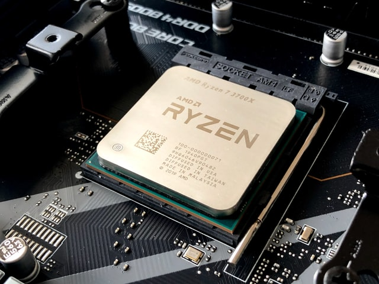

##### Apa itu AMD Ryzen?

**Ryzen** adalah nama merek dari keluarga prosesor komputer AMD - dan tercepat - terbaru. Pertama kali dirilis pada tahun 2017, CPU (central processing unit) dan APU(accelerated processing unit) Ryzen dibangun di atas mikroarsitektur "Zen" AMD yang sangat maju, teknologi prosesor AMD generasi ke-8, dan menandai pengenalan prosesor besar pertama perusahaan sejak seri FX / A6 sekitar lima tahun sebelumnya.

Prosesor Ryzen mendapat pujian cepat dari para analis dan pengulas teknologi yang mengatakan AMD sekarang dapat bersaing dengan Intel dalam hal kinerja prosesor, bukan hanya harga, bahkan sudah mengalahkan intel yang setara, terutama dari segi  price to performance. Dan kita sekarang sedang menantikan AMD Ryzen seri 4000 yang lebih kuat dari sebelumnya. 

Peluncuran produk awal AMD mencakup beberapa versi berbeda dari prosesor Ryzen:

- Ryzen: Beberapa versi tersedia untuk PC desktop dan laptop
- Ryzen PRO: Menampilkan keamanan tambahan dan kemampuan manajemen tingkat perusahaan (ideal untuk penggunaan perusahaan dan bisnis)
- Ryzen Mobile: Gabungkan CPU Ryzen dengan grafis AMD Radeon Vega

##### Apakah prosesor Ryzen lebih baik?

Dengan Ryzen (diucapkan RYE-zen), AMD mmasuk ke dalam arena "perang prosesor". Sudah lama dipuji karena kemampuan grafis terintegrasi dan biaya yang relatif rendah, memang dulunya di Indonesia AMD hanya populer di kalangan gamer dan  overclocker, tapi prosesor AMD lama masih kalah dalam uji kinerja benchmark terhadap chip Intel yang setara. Tetapi dengan Ryzen, AMD menambahkan lebih banyak inti (bahkan chip Ryzen dasar dilengkapi dengan quad-core), memperluas penawaran kelas menengahnya hingga enam inti / 12 threads (model berkinerja tinggi dapat memiliki 8/16 atau lebih), dan diperkenalkan Teknologi Simultan Multi-Threading (SMT) untuk mendorong lebih banyak operasi melalui setiap inti.

Untuk yang belum tahu, "inti" prosesor pada dasarnya adalah CPU terpisah untuk dirinya sendiri. Jadi, prosesor modern, quad-core atau octa-core sebenarnya memiliki empat atau delapan chip prosesor yang dapat digunakan untuk melakukan pemrosesan berat komputasi. Setiap inti memiliki satu atau dua "threads" atau utas (benang) yang membawa set perintah dan respons berbeda yang diperlukan untuk menghitung, membuat grafik, menjalankan program perangkat lunak, dan yang lainnya. Dan Simultan Multi-Threading baru dari AMD (mirip dengan Hyper-Threading Intel) memungkinkan setiap threads digunakan secara lebih efisien, yang selanjutnya melipatgandakan produktivitas prosesor.

Para profesional segera mengkonfirmasi klaim AMD tentang Ryzen, mengatakan chip baru itu sama atau lebih baik dengan yang ditawarkan oleh produsen lain, termasuk Intel, dalam banyak kategori kinerja. Para pesaing tersebut mungkin tidak setuju atau menawarkan hasil tes yang bersaing (ini adalah bisnis yang sangat kompetitif), tetapi mengingat keunggulan harga AMD yang berkelanjutan, banyak analis teknologi pmenggunakan istilah seperti "mengganggu" dan "pengubah permainan" untuk menggambarkan pengenalan Ryzen ke pasar. Namun sekarang sudah berbeda cerita, Ryzen sudah menjadi new mainstream, sementara intel hanya populer di kalangan gamer saja atau mungkin sekelompok orang yang tinggal di goa beberapa tahun belakang ini.

##### Apakah Ryzen bagus untuk gaming?

Para pemain game PC jelas merupakan target audiens Ryzen, apalagi AMD juga terkenal dengan kartu grafisnya dengan seri Radeon, sebetulnya bisa bersaing di kelas GPU "menengah" seperti RX 580. Dan untuk permainan game, Ryzen - dengan peningkatan kinerja per-inti dan fitur overclocking baru mengungguli prosesor AMD sebelumnya dengan selisih yang cukup besar. Jadi, bagi sebagian besar gamer, terutama mereka yang tidak merakit sistem mereka sendiri yang dikonfigurasi khusus dan dioptimalkan untuk game, PC yang didukung Ryzen adalah pilihan yang logis dan dapat menghemat uang Anda. Sebagai catatan untuk GPU AMD, dari saya sendiri juga ada 2 hal yang mengganggu, pertama adalah **driver**, driver AMD kadang kala kacau, jadi ini adalah kelemahan yang sering dikeluhkan, tidak bisa mengeluarkan potensi maksimal, atau bahkan paling lucu adalah crash, sehingga beberapa orang memilih menggunakan driver versi tertentu, meskipun sudah berlalu banyak update. Kedua, power consumption, sahabat PLN, boros daya, mungkin masih berhubungan dengan kelemahan pertama yaitu driver, tidak ada yang bisa memastikan.

Tes benchmark awal menemukan chip Ryzen berkinerja kurang baik untuk beberapa game daripada chip Intel Core **"i"** terbaik saat itu. Namun, eksekutif AMD dan banyak produsen game memperkirakan bahwa penyetelan kinerja yang berkelanjutan akan membantu Ryzen mengejar ketertinggalan dengan cepat. Selain itu, Ryzen hadir dalam versi Threadripper yang sangat bertenaga dengan 16 core dan 32 thread yang bisa menjadi pilihan yang baik bagi mereka yang merakit platform game mereka sendiri. 

Saya mencatat ada dua hal yang membuat AMD "kalah" dalam gaming benchmark (tapi tidak untuk yang lain, AMD menang semua tes, kecuali gaming (untuk beberapa seri)), pertama hampir semua game PC masih dioptimalkan untuk kinerja 1 core, dan tidak untuk multi, sedangkan AMD sebaliknya membuat kinerja 1 core-nya lebih efisien dan hemat daya, jadi itulah yang terjadi. Meskipun "kalah" jangan membayangkan pengalaman gaming dengan AMD itu buruk, pendapat saya tidak sama sekali, skor "9" dengan "8.7" itu sangat dekat dan di dunia nyata, tidak akan ada rasa berbeda. Satu lagi tentu problem klasik, semua pengembangan dikaitkan ke intel prosessor, karena intel menjadi raja cukup lama, sampai AMD mengambil alih, sekarang isu ini sudah hampir hilang.    

**Apa yang membuat Ryzen berbeda?**
Dari perspektif pemasaran, AMD untuk pertama kalinya mengadopsi nomenklatur prosesor 3-5-7  kemudian masuklah 9, yang sekarang standar untuk membedakan unit dasar (Ryzen 3) dari penawaran kelas menengah (Ryzen 5) dan kinerja tinggi (Ryzen 7 dan 9). Namun, ada beberapa tumpang tindih antara kategori Ryzen, jadi tergantung pada spesifikasinya, Ryzen 3 kelas atas mungkin lebih cepat daripada Ryzen 5 kelas bawah, dalam beberapa kasus. Untuk penggunaan yang lebih khusus ada Ryzen Threadripper (lihat di atas) dan prosesor server yang berpotensi lebih kuat, Epyc, yang juga dibangun di atas arsitektur Zen baru AMD. Untuk kelas starter biasa ada embel-embel **G**, **GE** , kemudian tanpa embel-embel, kemudian ada tambahan X atau XT.

- Namun di luar pemasaran, apa yang membuat Ryzen berbeda? Dibandingkan dengan prosesor AMD sebelumnya, Ryzen memiliki beberapa keunggulan fisik:

- Struktur transistor 14nm yang lebih kecil yang mengkonsumsi lebih sedikit daya dan menghasilkan lebih sedikit panas. lebih sedikit sumber daya bersama - membuat setiap inti lebih terpisah dan mandiri
- Tautan intra-prosesor yang ditingkatkan untuk penyesuaian dengan cepat pada pemanfaatan inti / threads
- Kemampuan overclocking yang dapat mengeluarkan siklus prosesor tambahan untuk kebutuhan spesifik
- Dan tentu sejak **"zen 2"**yang menggunakan arsitektur **7nm**, tentu semuanya jauh lebih baik.

##### Memahami terminologi Ryzen

Saat mempertimbangkan prosesor Ryzen atau PC yang dilengkapi Ryzen, ada beberapa nama fitur AMD dan istilah pemasaran yang perlu Anda ketahui:

**Teknologi SenseMI**: Istilah umum untuk mendeskripsikan serangkaian fitur yang disebut "belajar dan beradaptasi" yang membantu RyProsesor zen menyesuaikan pengoperasiannya berdasarkan cara Anda menggunakannya.
E**xtended Frequency Range (XFR)**: Menyediakan opsi - dengan pendinginan yang memadai - untuk "melakukan overclock" prosesor guna mencapai kecepatan siklus yang lebih tinggi (meningkatkan chip Ryzen berperingkat teratas dari, katakanlah, 3,6 GHz menjadi 4,2 GHz). Beberapa sistem bertenaga Ryzen dilengkapi dengan pendingin tambahan untuk mengaktifkan XFR sementara pada yang lain, pendingin semacam itu adalah tambahan.
**Peningkatan Presisi**: Memungkinkan Ryzen untuk membuat penyesuaian frekuensi yang sangat terperinci secara otomatis (25MHz sekaligus) untuk meningkatkan kinerja tanpa menghabiskan lebih banyak daya. Dimulai ketika Ryzen merasakan kebutuhan beban kerja untuk pemrosesan yang lebih cepat sementara pada saat yang sama merasakan bahwa ia memiliki ruang kepala termal untuk memungkinkannya berjalan lebih cepat untuk suatu waktu.
P**rediksi Jaringan Neural**: Memungkinkan Ryzen untuk belajar dari cara Anda menggunakannya dan pada dasarnya "membaca ke depan", mengantisipasi langkah selanjutnya dalam alur kerja Anda dan membuat penyesuaian jalur untuk memastikan setiap tugas bergerak melalui prosesor seefisien mungkin.
**Smart Prefetch**: Mempelajari cara kerja program Anda dan mencoba memuat data secara proaktif ke prosesor untuk kinerja dan alur kerja aplikasi yang lebih cepat. Bekerja bersama dengan Prediksi Jaringan Neural.
Banyak dari fitur ini bergantung pada apa yang AMD sebut sebagai Infinity Fabric, sebuah pendekatan baru pada material substrat prosesor yang menghubungkan semua inti, threads, dan komponen lain dalam "jaringan latensi rendah dalam sebuah chip" berkecepatan tinggi. AMD mengatakan sensor Infinity Fabric memantau kecepatan siklus, suhu, dan voltase untuk mengaktifkan penyesuaian sambil jalan untuk kinerja prosesor yang maksimal.

**Kesimpulan**, jangan ragu menggunakan processor AMD Ryzen untuk menjemput masa depan komputasi yang indah.