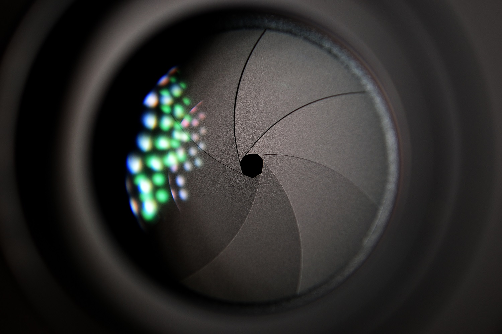
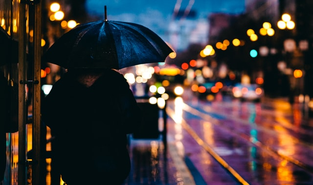
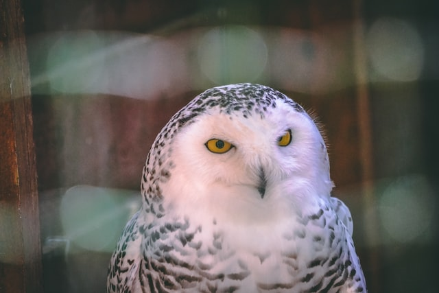

Bokeh berasal dari kata Jepang boke (ボ ケ), yang berarti "kabur" atau "kabut", atau boke-aji, "kualitas buram". Cara bacanya mirip dengan bokek, yang artinya nggak punya/kurang duid itu . Banyak orang menggandrungi bokeh ini dan berusaha membokehkan segala sesuatunya dalam setiap foto atau video, memang tampak bagus, kadang-kadang tidak perlu, berlebihan atau bahkan "dilarang", seperti foto landscape atau foto orang banyak.

###### Apakah Bokeh itu?

Bokeh didefinisikan sebagai "efek latar belakang lembut di luar fokus yang anda dapatkan saat memotret subjek, menggunakan lensa cepat  , pada aperture terlebar, seperti f / 2.8 atau lebih lebar (f/2.0, f /1.4, semakin kecil semakin lebar)." Sederhananya, bokeh adalah kualitas estetika dari keburaman di luar fokus yang menyenangkan atau estetika dalam foto.

###### Aperture Terbaik untuk Bokeh

Cara mendapatkan bokeh yang berkualitas (indah) tentunya menggunakan lensa bukaan lebar/ lensa "cepat",  semakin cepat semakin baik. Carilah lensa dengan setidaknya bukaan f / 2.8, dengan bukaan yang lebih cepat dari f / 2, f / 1.8 atau f / 1.4 yang ideal. Saya sendiri menggunakan lensa f/ 1.4 dan hampir tidak pernah lepas dari kamera APSC saya.

###### Lensa Terbaik untuk Bokeh

Meskipun bokeh sebenarnya merupakan karakteristik sebuah foto, namun lensa yang digunakan menentukan bentuk dan ukuran bokeh yang terlihat. Biasanya terlihat lebih banyak pada sorotan, bokeh dipengaruhi oleh bentuk bilah diafragma (apertur) lensa. Lensa dengan bilah berbentuk lebih melingkar akan memiliki bola sorotan di luar fokus yang lebih bulat dan lebih lembut, sedangkan lensa dengan apertur yang lebih berbentuk heksagonal akan memantulkan bentuk itu dalam sorotan.

Jadi Blade pada lensa sangat berpengaruh, dan tentunya kualitas optic itu sendiri, karena orang akan melihat keseluruhan gambar, bukan hanya pada bagian blurnya saja.

###### Cara Mencapai Bokeh

Untuk meningkatkan kemungkinan menciptakan bokeh yang terlihat dalam foto anda, tingkatkan jarak antara subjek anda dan background, misalnya anda mengambil foto outdoor, dengan background tak terhingga, tentu lebih mudah. Tapi, anda dapat melakukan ini dengan mengurangi jarak antara kamera dan subjek. Semakin dangkal depth-of-field, atau semakin jauh latar belakangnya, akan semakin tidak fokus. Sorotan yang mengenai latar belakang juga akan menampilkan bokeh yang lebih terlihat, jadi jika anda menggunakan lampu latar, cahaya samping, atau lampu rambut, bokeh mungkin lebih enak dipandang. Jadi tentunya pencahayaan memegang peran besar disini, outdoor dengan lampu terkontrol akan sangat indah bosku.

###### Pengaturan Kamera Bokeh

anda ingin memotret dengan lensa terbuka lebar, jadi anda akan ingin menggunakan mode pemotretan Aperture priority atau sekalian manual. Manual memberi anda kemampuan untuk memilih aperture dan shutter speed, sedangkan aperture priority memungkinkan anda memilih f / stop sementara kamera memilih shutter speed yang sesuai untuk pencahayaan, ISO juga bisa dibuat otomatis. anda juga dapat menggunakan mode Program Fleksibel, memilih kombinasi kecepatan rana / apertur seluas mungkin.

###### Bokeh dalam Portrait

Bokeh pada portrait paling sering kita lihat dalam dunia perbokehan, baik foto maupun video, coba perhatikan top youtuber, banyak sekali yang menggunakan efek bokeh, meskipun mereka sedang di studio. 

Bokeh dapat menambah kelembutan pada foto yang tadinya terang benderang. Menggunakan teknik ini untuk memisahkan subjek anda dari latar belakang juga dapat memungkinkan anda untuk memanfaatkan latar belakang yang tidak terlalu fotogenik dalam gambar anda, tetapi karena keburamannya yang tersebar, ini membantu untuk "menyorot" subjek, bukan mengurangi darinya.

Jika anda mempunyai model yang fotogenik atau memang suka diekspose dengan seditil-detilnya(sampai ke pori-pori) maka bokeh dengan subyek yang sangat tajam akan membuat foto/video anda jadi indah, apalagi dengan tambahan bola-bola lampu/ cahaya di belakang.

###### Penutup tentang Bokeh

- Aperture cepat akan menghasilkan bokeh  yang terbaik (setidaknya f / 2.8).

- Gunakan lensa prime .

- Panjang fokus yang panjang menciptakan bokeh yang lebih ekstrim.

- Bidik dengan lensa terbuka lebar

- Tambah jarak antara subjek dan latar belakang (misal infinity, tapi tidak harus, yang separasinya cukup)

- Mendekatlah ke subjek anda

- Ambil potret close-up dan gambar makro di alam(tetesan air bisa indah dengan bokeh)

- Gunakan lampu latar, lampu samping, atau lampu rambut
- Pastikan kamera anda stabil, gunakan tripod bila perlu, kalau goyang bisa jadi mimpi buruk. 
- Ini adalah cara bokeh dengan kamera, cara lainnya adalah dengan editor foto atau video.

