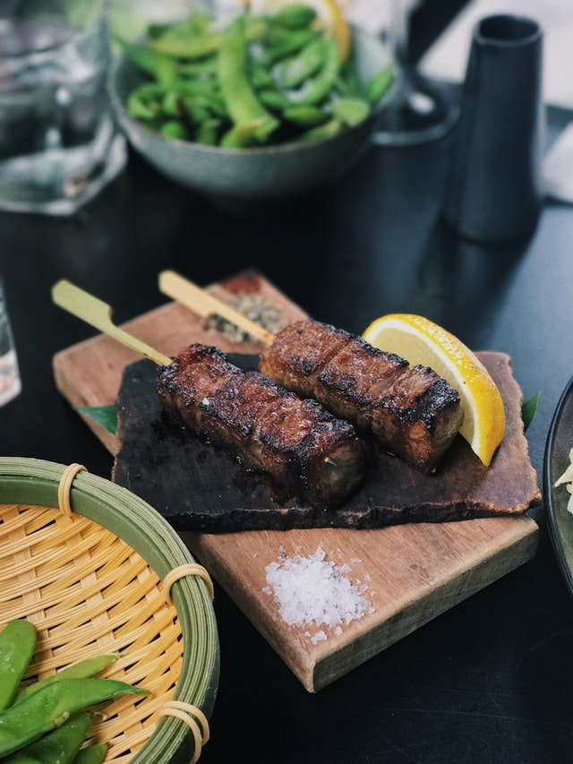
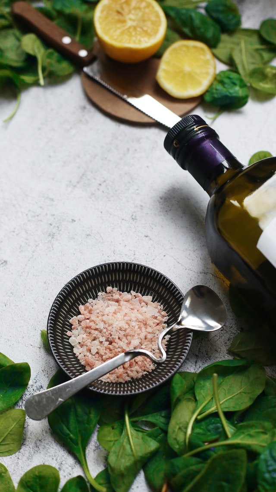

Mungkin kita terbiasa mengkonsumsi garam tanpa mengecek apa yang terkandung di dalamnya, padahal ini adalah sangat penting terhadap kesehatan anda, bahkan rasa yang ditimbulkan terhadap masakan juga akan berbeda.

#### Garam Laut

Garam laut diproduksi melalui penguapan air laut atau air dari danau air asin, biasanya dengan sedikit pemrosesan. Bergantung pada sumber air, ini meninggalkan sedikit mineral dan elemen. Mineral tersebut menambah rasa dan warna pada garam laut, yang juga memiliki berbagai tingkat kekasaran. Jika anda ingin membuat garam sendiri, sebenarnya mudah, ambil air laut, kemudian uapkan, baik dengan cara alami(sinar matahari) atau dipanaskan.

#### Garam Meja

Garam meja biasanya ditambang dari endapan garam bawah tanah. Garam meja lebih banyak diproses untuk menghilangkan mineral dan biasanya mengandung aditif untuk mencegah penggumpalan. Sebagian besar garam meja juga telah menambahkan yodium, nutrisi penting yang membantu menjaga kesehatan tiroid.Garam meja akan lebih halus dan kurang asin, untuk masakan apalagi roti-rotian, sebenarnya masih lebih enak garam laut.

Garam laut dan garam meja memiliki nilai gizi dasar yang sama, padahal garam laut sering disebut-sebut lebih sehat. Garam laut dan garam meja mengandung jumlah natrium yang sebanding menurut beratnya.

Tetapi dalam prosesnya, garam laut  relatif lebih sehat, tentu karena tidak ada penambahan zat lain, pemrosesan berlebihan, dll.

Jadi saya pribadi akan selalu menggunakan garam laut, bila perlu dari petambak lokal, karena lebih enak dan sehat, tentu dengan batasan.

Jenis garam apa pun yang Anda sukai, lakukan dalam jumlah sedang atau rendah. Pedoman Diet untuk orang Amerika merekomendasikan untuk membatasi **Natrium** hingga kurang dari 2.300 miligram sehari. **Sodium** juga sesuatu yang harus dibatasi, tidak perlu menghawatirkan **Yodium**, karena ini bukan tahun 1800-an, di garam laut sebetulnya ada, dan sumber makanan lain juga.

Garam meja juga sebetulnya dari laut, terjebak di perut bumi. Pastikan garam meja anda tidak mengandung zat kima yang berbahaya, kita tidak akan sanggup melawan kapitalisasi garam, impor garam(meja), dll. Kita hanya bisa menjaga keluarga kita dengan menggunakan garam laut, atau garam meja sehat lokal jika ada, jika dimungkinkan, kita bisa membuat garam sendiri dengan cara mengambil air laut dan menguapkannya. 

Istilah garam meja, dapur, khoser,himalaya, laut hanyalah istilah, sumber dari mana itu penting, dan paling penting adalah kandungan yang ada di dalamnya. 