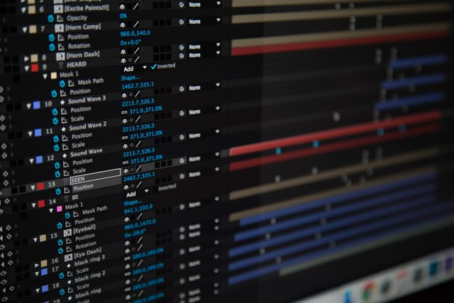

Mari kita melompat ke dunia produksi video yang menarik banyak orang, menghibur, dan menginspirasi.

Artikel ini membahas pintu masuk ke dalam video-video hebat dan atau viral, dan ini sebagian besar melalui editing video, yang membuat pesan yang disampaikan jadi lebih bermakna. Jadi  langsung kita mulai dengan belajar mengedit video dengan standar profesional, langkah-langkahnya adalah: 

### Buat naskah, dan buatlah naskah  yang betul-betul menarik  

Pernah melihat iklan di youtube? Biasanya kita skip, karena kita biasanya benci iklan, tetapi jika anda lengah aatu sengaja membiarkan iklan itu berjalan, anda akan melihat video yang menarik tentang suatu produk, toko, atau jasa, dalam waktu yang sangat singkat produk yang diklankan akan masuk ke dalam pikiran anda. Jika anda mempunyai produk untuk dijual, dan akan mempromosikan dengan video, maka anda perlu belajar dari video-video iklan itu, dan slah satu unsurnya adalah **naskah/ script**.

Naskah terbaik tergantung pada jenis video yang ingin anda buat. Skrip/ naskah yang efektif harus:

- Miliki tujuan yang jelas dan spesifik untuk audiens. Apa yang anda ingin video anda lakukan? Siapa yang akan menontonnya? Memperjelas tujuan video akan membantu anda menyajikan pesan dengan cara yang lebih menarik.
- Fokus pada satu ide pada satu waktu. Cari tahu apa ide utama dari video anda dan fokuslah pada itu. Dengan tetap berpegang pada satu tema atau masalah pada satu waktu, anda dapat membuat video yang lebih padat dan informatif. Ini adalah teknik komunikasi yang sudah umum sebetulnya.
- Bicaralah dengan audiens anda. Video adalah percakapan. Saat menulis naskah anda, pikirkan tentang pertanyaan, pemikiran, dan perasaan apa yang ada di benak pemirsa dan jawablah.

### Pilih kombinasi warna yang tepat untuk video anda

Warna secara langsung mempengaruhi persepsi dan suasana hati kita. Pengalaman hidup, preferensi, latar belakang budaya, dan semuanya memengaruhi cara kita memandang warna. Itulah mengapa sangat penting untuk selalu memperhatikan penonton anda saat menyusun skema warna untuk video anda. Ini tidak ada perdebebatan, segera susun skema warna yang anda presentasikan untuk audiens anda.

Bagaimana anda menggabungkan palet yang menarik jika pengetahuan anda tentang teori warna masih samar-samar? 

RGB: Sistem warna ini digunakan untuk semua tampilan elektronik, begitulah cara anda melihat warna di ponsel, tablet, dan TV. Warna primer yang digunakan di sini adalah merah, hijau dan biru.
HEX: Kode hex adalah angka enam digit yang digunakan untuk mewakili warna RGB untuk tampilan layar. Kami menggunakan kode hex di Biteable karena itu adalah kode default untuk web. Kode hex akan berupa hash yang diikuti oleh enam angka dan / atau huruf, dan terlihat seperti ini: \#D4AF37.

### Gunakan dan hasilkan video berkualitas tinggi

Memilih gambar yang tepat untuk video anda dapat membuat atau menghancurkannya. Gambar beresolusi tinggi sangat penting jika anda ingin video anda menonjol. Saat ini 4k sudah bukan barang mewah lagi, bahkan sudah memasuki 8k, tentu gunakan sumber gambar mentah yang beresolusi tinggi juga. Keuntungan lain, ketika anda melakukan cropping, maka gambar anda masih bagus. Full HD adalah minimal, jika anda mengambil gambar dengan resolusi diatasnya, maka akan lebih bagus.

### Kualitas audio yang tinggi adalah mutlak

Sebagian besar dari kita akan menerima video dengan kualitas kurang dari HD jika suaranya berkualitas tinggi, bahkan lama kita mendengarkan radio, dan masih bisa menikmati. Intinya, jika audio anda tidak berfungsi, video anda tidak akan terlalu efektif.

Saat anda membuat video Biteable anda sendiri, anda memiliki dua opsi utama - anda dapat menambahkan musik yang bagus atau mengupload suara anda sendiri. Jika menggunakan musik, jangan gunakan musik yang haknya tidak anda miliki, jika anda mengunggahnya di sosial media akan kena pinalti, bahkan anda bisa berurusan dengan hukum. Tenang, masih ada sumber audio gratis, untuk mendramatisir video anda. 

Sumber suara, terutama dari vokal, didapat dari microphone yang bagus, dan lingkungan yang terkontrol, dipadu dengan  mixing audio yang profesioanl, terbentang dari budget minimal sampai tak terhingga. 

### Format video anda seperti seorang profesional

Sama seperti anda mendapatkan semua jenis dokumen teks, video hadir dalam berbagai format yang cukup besar. Yang paling umum untuk streaming online adalah MP4, FLV, dan WMV.

Ketiganya didukung oleh platform media sosial utama dan berfungsi dengan baik saat online. Perhatikan juga bitrate dan parameter lain, misal seberapa besar video anda, ingat target audiens anda.

### Memasarkan video anda

Sekarang setelah anda membuat video, saatnya menyebarkannya kemana-mana, tentu harus ditargetkan, bagikan video anda di media sosial. Konten video di media sosial mendapatkan lebih banyak keterlibatan, komentar, dan pembagian, jadi jangan takut untuk menggunakannya! jika memang anda betul-betul serius, pertimbangkan untuk meng-iklan-kan video anda. Sebagian besar platform media sosial sekarang mendukung iklan video.
Tentu saja, untuk menggunakan video dalam kampanye pemasaran, anda harus menyimpannya di suatu tempat. YouTube dan Facebook adalah tempat yang bagus untuk memulai, namun, ada banyak opsi lain untuk hosting video, ingat ini adalah investasi, jadi anda harus menghitung.

### Menyatukan semuanya

Membuat video yang asyik untuk ditonton tidak harus sulit. Dengan skrip yang menarik, gambar yang menarik, dan skema warna yang menarik, anda dapat membuat orang memperhatikan apa yang ingin anda katakan. Jika rencana anda matang, maka mulai dari pengambilan gambar sampai finishing, akan lebih mudah dan hasilnya akan mempunyai impact. 

Anda mungkin mencari hal-hal teknis disini, percayalah, itu jauh lebih mudah ketika anda mempunyai konsep, mulailah dengan konsep kemudian gear yang tepat, kemudian pengambilan gambar (skip jika hanya mengedit saja). Selanjutnya editing,  aplikasi video editing Blackmagic  Davinci Resolve, gratis, untuk color correcting dan grading Davinci sangat bagus, bahkan pada versi gratisnya. Demikian juga dengan mengedit audio, fantastis, percayalah anda mungkin mengira BM ini goblok dengan memberikan software secara gratis, sementara adobe, anda harus berlangganan minimal 50 US dollar per bulan untuk menggunakan bundle software mereka. 

